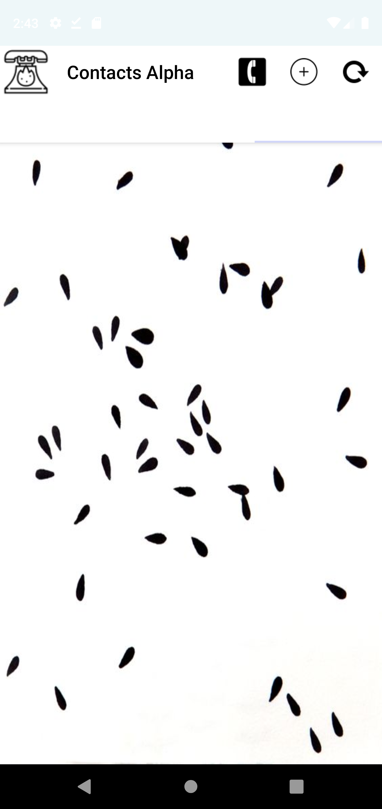
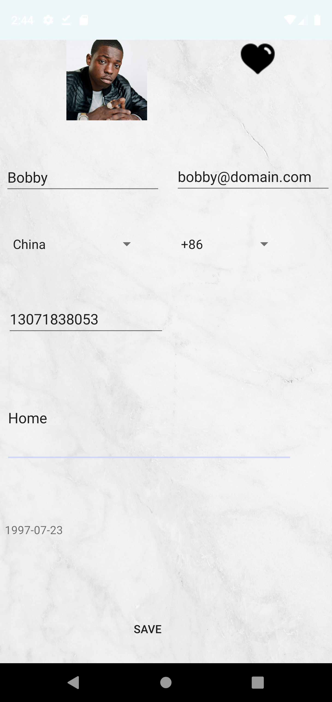
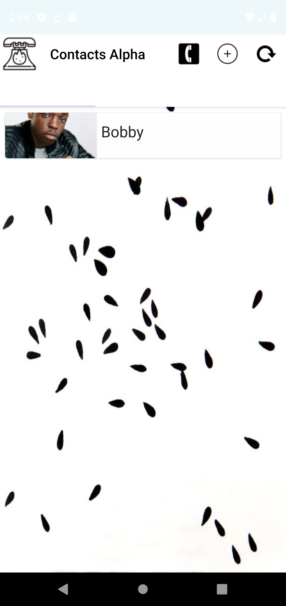
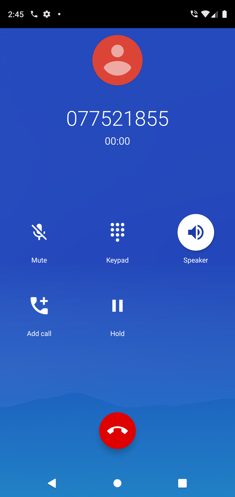

## Contacts Alpha - Contacts Manager
### [**Created by Leon**](https://bletomus.github.io/) **Pirate Utilities**

### Contacts Alpha

ContactsAlpha is a lightweight contacts management application which provides a simple interface to save contacts for local business and personal usage

- _Duration_: June 2018 – July 2018
- _Team Size_: 1
- _Role Played_: Developer and Tester
- _Skills: SQLite_, Java, Android Studio

### Features
- Ability to save contact and details such as preference, favorite or note, phone number, address, email and date of birth

- View Contact list

- Make call to saved contacts

 
## Contact Me
To view my other projects just follow this [link](https://bletomus.github.io/) or send me an email at leonkanyayi@yahoo.com

